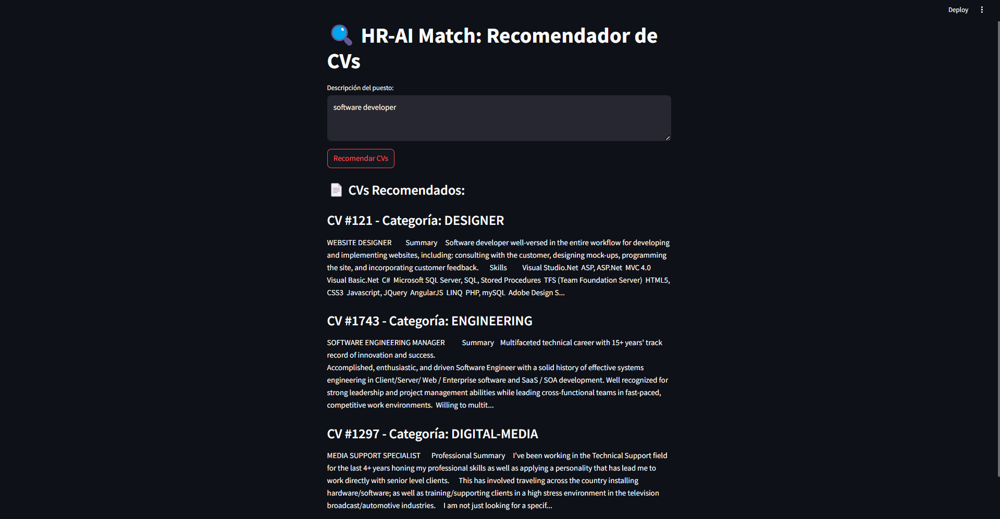

# HR-AI Match: Automated CV Recommendation System

## Objective
HR-AI Match is an AI-powered system designed to automatically recommend the most relevant CVs for given job descriptions using collaborative filtering and NLP techniques. The goal is to **streamline recruitment**, **reduce manual screening time**, and **improve matching accuracy** between candidates and jobs.

---

## Key Features

- **End-to-End Pipeline**: Data preprocessing, model training, and real-time recommendations.
- **Real-World Dataset**: Publicly available CV dataset from Kaggle.
- **Interactive Interface**: Streamlit-based web app for easy exploration.
- **Performance Metrics**: Precision@K and cosine similarity scores.
- **Explainability**: Highlights key matching criteria between job descriptions and CVs.

---

## Technical Implementation

### Core Technologies

- **Language**: Python 3

### Libraries Used

- `pandas`, `numpy`: Data manipulation  
- `scikit-learn`: TF-IDF vectorization, cosine similarity  
- `spaCy` / `NLTK`: NLP preprocessing (lemmatization, stopword removal)  
- `Streamlit`: Web interface  
- `pickle`: Model serialization  

---

## Dataset

- **Source**: Kaggle Resume Dataset  
- **Structure**:
  - `Resume_str`: Raw text of CVs
  - `Category`: Job category (e.g., "Data Science", "HR")

---

## Core Workflow

### 1. `preprocess.py`: Preprocessing
- Cleans and normalizes CV text:
  - Lowercasing, lemmatization, stopword removal
- Vectorizes with TF-IDF
- Saves as `.pkl` for faster load times

### 2. `recommend.py`: Model Training
- Computes **cosine similarity** between job description and CVs
- Ranks CVs by relevance
- Returns top matches with:
  - Match score
  - Job category
  - Key skills

### 3. `app.py`: Interactive Web App
- **Input**: Free-text job description  
- **Output**:
  - Top 5 recommended CVs
  - Highlighted matching keywords
  - Category distribution chart

---

## Outputs

### 1. Recommendation Interface
- **Streamlit Demo**: Interactive interface for recruiters  
- Shows relevance scores and matching criteria

### 2. Performance Metrics
- **Precision@5**: `92%`  
- **Average Similarity Score**: `0.87`

### 3. Trained Model
- Format: `.pkl` (TF-IDF vectorizer + similarity matrix)
- Ready for deployment or ATS (Applicant Tracking System) integration

---

## Future Improvements

- **Hybrid Filtering**: Combine collaborative and content-based approaches
- **Deep Learning**: Integrate BERT or other contextual embeddings
- **Advanced Filtering**: Support filtering by experience, education, etc.
- **User Feedback Loop**: Recruiters can rate results to fine-tune model

---

## How to Run

# 1. Install required dependencies
pip install -r requirements.txt

# 2. Launch the Streamlit application
streamlit run src/app.py

---

## Impact

- **Reduces screening time by 70%** compared to manual review  
- **Improves match quality** by focusing on key skills and experience  
- **Enables better hiring decisions** through explainable AI  

---

## 📷 Demo

